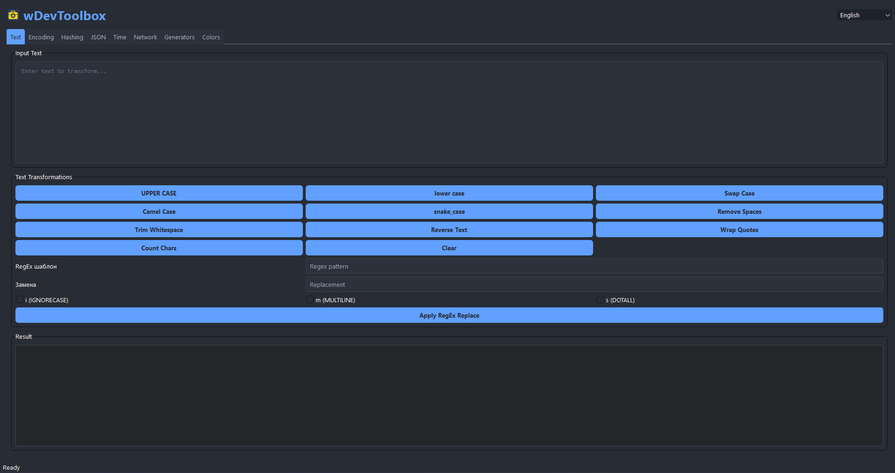

# 📦 wDevToolbox
**A multifunctional developer toolkit**

***
## 🚀 Features

### **Text Tools**

- **Find & Replace with RegEx**
- **Character and word count**
- **Transliteration (Cyrillic ⇄ Latin)**

### **Encoding**

- **Base64 / Base32 / Base85**
- **URL / ACSII / HEX**

### **Hashing**

- **MD5, SHA, BLAKE2**
- **HMAC with key**

### **JSON**

- **Pretty-print and minify**
- **JSONPath queries**

### **Time**

- **Convert UNIX timestamps**
- **Date difference calculator**

### **Network**

- **HTTP client with headers and authentication**
- **Ping**
- **Whois**

### **Generators**

- **Secure password generator**
- **QR code generator (save as PNG)**

### **Colors**

- **HEX ⇄ RGB ⇄ HSL**
- **Gradient generator**
***
## 📥 Installation
**1. Clone the repository:**
```
git clone https://github.com/PoWes7o4kKka/wDevToolbox.git
cd wDevToolbox
```
**2. Install dependencies & Run:**
```
pip install -r requirements.txt
python main.py
```
***
## 📜 License
MIT